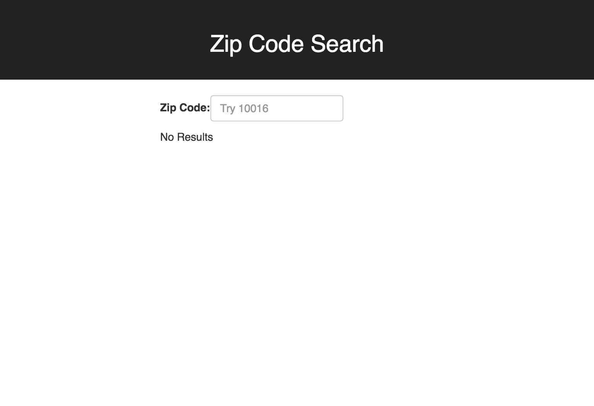

# City-Zip-Search

## Installing `create-react-app`

The `create-react-app` utility helps you create new React projects easily. It handles generating a project, setting up babel, a dev server, and testing. It is the fastest way to get started developing react apps locally.

You only have to install the utility once using the following commands:

```
npm install -g npm
npm install -g create-react-app
```

> Note: the first command is to make sure you're running the most up to date version of npm.

## The Zip and City search API (ctp-zip-api)

### `/zip/:zipcode` - find Cities associated with a zipcode

`http://ctp-zip-api.herokuapp.com/zip/:zipcode`

provide the zipcode in the url and you will receive a JSON response with an array containing an object for each city found. For example see:

http://ctp-zip-api.herokuapp.com/zip/10016

### `/city/:cityname` - find Zip Codes associated with a city name

`http://ctp-zip-api.herokuapp.com/city/:cityname`

`:cityname` must be in all caps

provide the city name in the url and you will receive a JSON response with an array containing a list of all zip codes for that city:

http://ctp-zip-api.herokuapp.com/city/SPRINGFIELD


## Zip Code Search app

This is a simple Zip Code search app. We will need an input field where the user can enter a zip code, like in the following image:



We will use the user input to search the ctp-zip-api. If the zip code is valid the API will respond with an object for each city. Use that response to display each city in a separate div like in the following image: 


### Getting started

- Fork this repo and clone your fork
- `cd City-Zip-Search/search`
- `npm install`
- `npm start`

`npm start` will launch a React dev server and should automatically open your browser. Leave the dev server running in the background and edit your code. When you save your changes you should notice your browser automatically reload to show you your new content or errors if any.


## City Search app

In this project we will allow the user to provide us a City name and we will display all of the associated zip codes to the user. 

To get started run the following commands

- `cd City-Zip-Search/search`
- `npm install`
- `npm start`

At this point you should see the React hello world page running on your browser. You should leave it running in the background while you work on this project.

Now open this folder (`city-search`) in your text editor. You will see all of the code the create-react-app setup for us. Since this is the stock project we can begin editing the files as we see fit. You can start at `App.js` and you can also edit `public/index.html` (to add Bootstrap for example).

